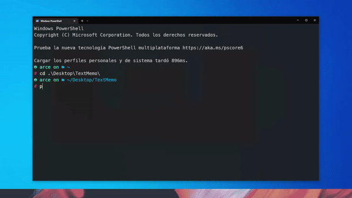
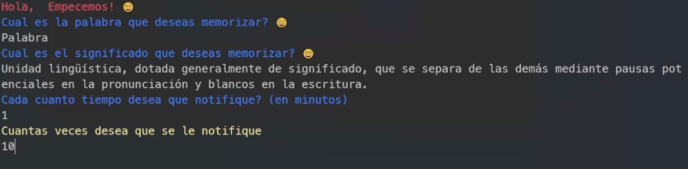
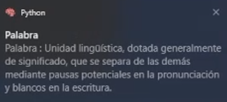

# Python script para aumentar nuestro vocabulario 

Este software hace uso de Python y notificaciones de Windows para ayudarte a recordar palabras, puedes usarlo con cualquier palabra en cualquier idioma que desees aprender. ✌ ✨


## Instalación 🎉

Necesitas haber instalado python 3.9:  https://www.python.org/

```bash
  pip install win10toast
  pip install rich 
 
```
Uso 📖
---------
* Corre :code:`python textmemoApp.py` para abrirlo. Asegurate de estar en la misma carpeta del archivo.

 **Opciones:** 
 ✔ Palabra
 ✔ Significado
 ✔ Tiempo de repeticion en minutos
 ✔ Número de veces    


## Demo
Prueba en Windows




## Capturas de pantalla



Por qué ? 🤔
------------
* Quería usar una herramienta ligera y libre para aumentar mi vocabulario.
* Prefiero usar la terminal
* No se almacena, rastrea ni comparte información de usuario.
* Me gusta la terminal.
* Escrito en Python 🐍.

## 🚀 Acerca de mi
Soy un futuro backend developer


## Apendice

Espero que os sea de utilidad
## Autor

- [@AgFranc](https://github.com/AgFranc)


